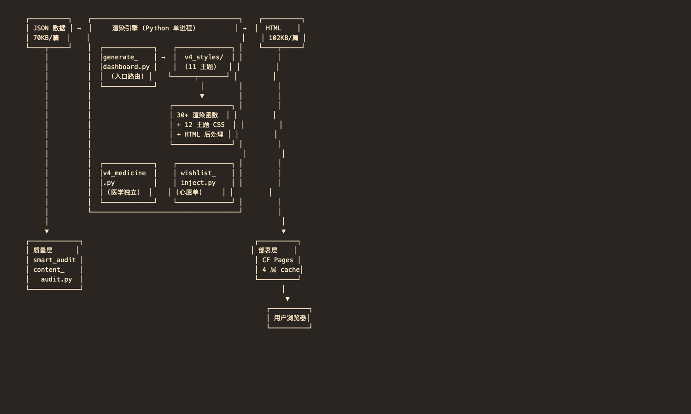
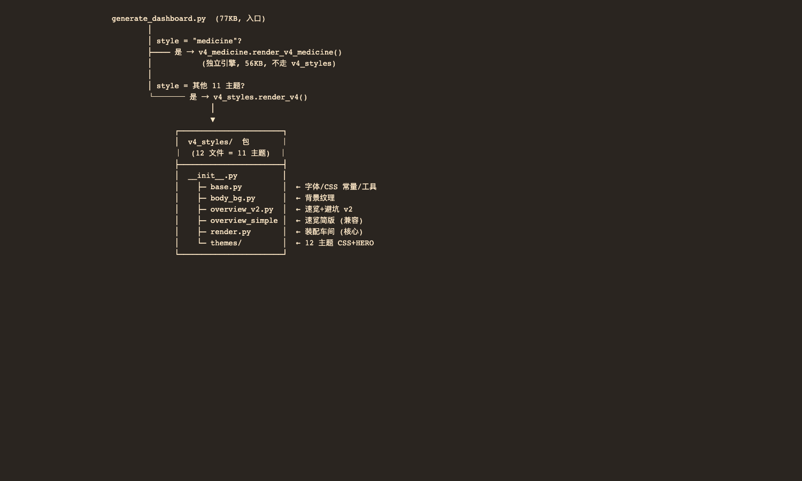
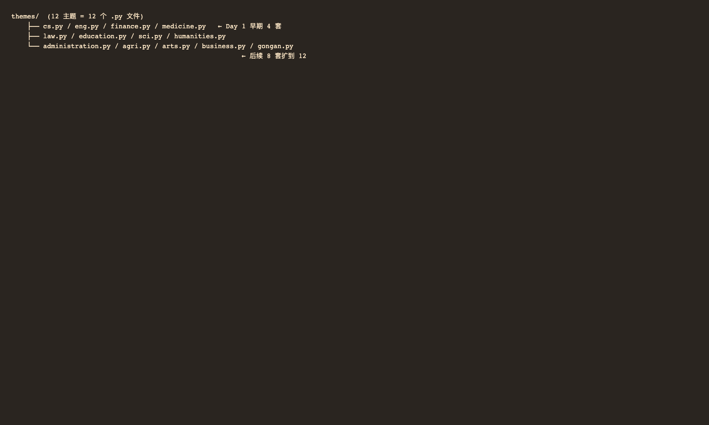
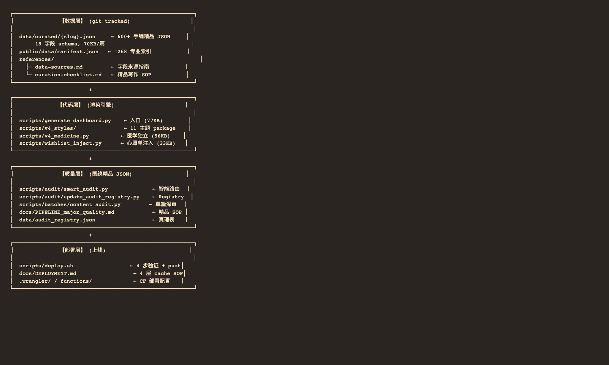
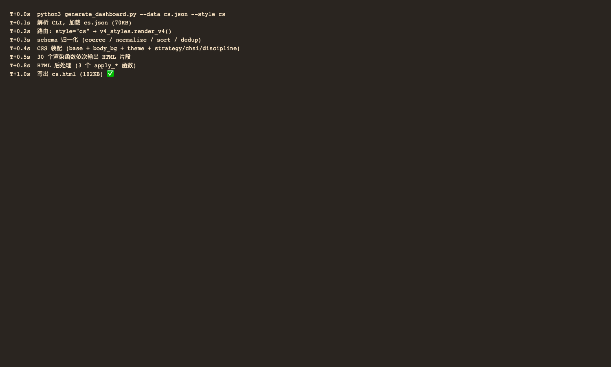

# gaokao-major-explorer 技术架构 · 30 天演化

> Technical Architecture · 一个高考专业介绍页生成器的 loop engineering 沉淀
> 2026-06-26 · Python 单进程 + 12 主题 · 1268 JSON · 600 完整精品 · v3.0 → v4.0 · **真实跨度 16 天**

> 配套 HTML 长图版:
> - 桌面优先: [`2026-06-26_skill-architecture.html`](2026-06-26_skill-architecture.html)
> - 公众号推送: [`2026-06-26_skill-architecture_wechat.html`](2026-06-26_skill-architecture_wechat.html)

---

## 00. 一句话定位

**输入**: 一份手编 JSON(18 字段, 70KB, 描述一个高考专业)
**输出**: 一份 60-100KB 的单文件 HTML 长图文, 内嵌 CSS + JS, 双击可开
**中间**: Python 单进程, 从 12 套主题里选一套, 把 JSON 字段装配成设计版面

| 指标 | 值 | 备注 |
|---|---|---|
| 数据规模 | 1268 | JSON 文件数 |
| 完整精品 | 600+ | 篇 (其余为基线) |
| 视觉主题 | 12 | 套 |
| 平均渲染 | <1 | 秒/篇 |
| 质量分 | 8.0+ | avg (m3 LLM 审计) |
| 代码量 | ~300 | KB |

---

## 01. 全景:从输入到输出

整个系统只有 **3 层**: 数据、引擎、产出。质量层和部署层围绕这三层运转。



> **核心命题**: 渲染引擎本身只占代码量 30%, 剩下 70% 是**质量审计链**。这才是 loop engineering 的真正价值 — **不期望能一次生成到位**, 而是建一套反馈闭环让内容持续逼近目标分。

---

## 02. 模块依赖图

入口 `generate_dashboard.py` 只做一件事: **按 style 字段路由**。



**v4_styles 包内部**关键设计 — 一切都是 Python 包, 主题是子目录:



> **关键洞察**: 加一个新主题只需要 1 个 `.py` 文件(几十行 CSS + 1 个 HERO_FN), **完全不用改**任何渲染函数。这就是下面要讲的"主题差异化最小化"原则。

---

## 03. 4 层架构:数据 → 代码 → 质量 → 部署

把视野拉到全局, 有 4 层相互配合:



---

## 04. 3 个核心设计模式

### ① 主题差异化最小化

12 套主题, 共享所有 30+ 渲染函数, 只换 3 块 CSS + 1 个 HERO 函数。

```
所有主题共用:  ─────────────────────────────
                30+ 渲染函数 (render_xxx)
                JSON schema 解析
                数据归一化 (salary/xuanke/curriculum)

主题差异化:    ─────────────────────────────
                3 个 CSS 块 (base + body_bg + theme)
                1 个 HERO_FN 函数 (每个主题一个)
```

### ② HTML 后处理管道化

Cross-cutting concerns(战略 chip、学科评估、面包屑)从渲染逻辑里抽出来, 做 HTML 后处理。

```
JSON → render_v4() 装配 HTML
            ↓
      apply_strategy_tags()        ← 国家战略 chip
            ↓
      apply_chsi_rating()          ← 学科评估标签
            ↓
      apply_discipline_breadcrumb() ← 学科面包屑
            ↓
      写出文件
```

### ③ Schema 容错漏斗

30 天里 JSON schema 演化过 N 次。容错层吸收所有差异, 渲染函数对历史脏数据完全免疫。

```
JSON 原始输入
    ↓
_coerce_named()        ← 字符串/对象兼容
    ↓
_normalize_xuanke()     ← 4 种 schema 变体统一
    ↓
_sort_salary_stages()   ← 主+次键排序
    ↓
_dedup_by_name()        ← schools 去重
    ↓
渲染函数  ← 此时 schema 已稳定
```

> **工程教训**: 没有这层容错, 30 天里每次 schema 调整都要改几十个渲染函数。漏斗模型让渲染函数**对历史脏数据免疫**, 这是 loop engineering 中"演进友好"的关键。

---

## 05. 单篇 JSON 的 1 秒旅程

以 `computer-science.json` 为例:



单篇 **< 1 秒**, 600 篇全量重渲染 ~5 分钟。

---

## 06. 16 天演化:质量分从 7.0 拉到 9.0

整个项目 16 天里实际发生了**两件事**, 且节奏完全不同:

- **6/10-17 扩量期**: 篇数从 60 涨到 367, 但平均质量分只有 ~7.0 — 这是**产能爬坡**, 不是质量改善
- **6/18 质量管线上线**(即下面第 7 章的步骤 5): 首批实测 **avg 7.0 → 7.6**
- **6/22 之后**: 配合智能路由批量精修, 质量分突破 **avg 9.0**, 8 分以上比例稳定 97%

所以叙事主线是**质量分提升曲线**, 不是篇目数量:

| 日期 | 发生了什么 | 质量 |
|---|---|---|
| 6/10 | **第一版渲染引擎上线**: 做出第一篇 CS 长图文, 定了 4 套视觉风格 | ~7.0 |
| 6/12 | **引擎重构**: 单文件拆成 12 文件 package, 主题从 4 套扩到 12 套 | ~7.0 |
| 6/17 | **扩量冲刺**: 篇数 78 → 367, 但质量仍是 ~7.0 — **产能上去了, 质量没跟上** | ~7.0 |
| **6/18 ★** | **质量管线上线**(即第 7 章的步骤 5): 智能路由审计。**首批实测 avg 7.0 → 7.6**, 证明流水线有效 | 7.6 |
| 6/22 | **批量精修**: 60 篇用智能路由全审一遍, 8 分以上篇数 337 → 480 一次 +143 篇 | 9.05 |
| 6/25 | **质量稳定**: 8 分以上比例 75% → 97%, 分数不再波动 (以前 ±1 分常见) | ~9.0 |

> 💡 **关键拐点**: **6/18 质量管线上线**是分水岭 —— 之前篇数上去了质量没变, 之后质量分从 7.0 拉到 9.0。
>
> **为什么不从篇目数量讲?** 因为扩量在质量管线上线**之前**就开始了 (6/14-16 大量补 JSON), 质量改善在管线上线**之后**才发生。两件事节奏不同。

---

## 07. 9 步质量闭环(loop engineering 的核心)

渲染引擎只是骨架。下面这套 9 步流水线才是让 600+ 篇精品稳定 ≥7 分的关键 — 藏在 [`docs/PIPELINE_major_quality.md`](../PIPELINE_major_quality.md)(v1.4) 里。

| 步骤 | 做什么 | 为什么 |
|:---:|---|---|
| 0 | **自动修复**专业代码字段 | 长期治理数据漂移 (Day 17 加入) |
| 1 | **读历史**: 必读历史审计问题清单 | 避免重复踩坑 |
| 2 | **反污染**: 前置必避的 4 大套路 | 模板套话 / 串台 / 占位 / 错位 |
| 3 | **手写数据**: 按专业逐字段填 JSON | 每篇独立内容, 不批量生成 |
| 4 | **渲染并部署**: 跑脚本 + git push | 每篇单独部署, 立即可见 |
| **5 ★** | **质量验证**: LLM 审计打分 **≥7 分才继续** | 否则进入步骤 6 重做 (见下方智能路由) |
| 6 | **分级重做** (1/2/3 档) | 档 1 补字段 → 档 2 整篇重写 → 档 3 标记跳过 |
| 7 | **一篇一提交**: 单专业单独 commit | 出问题可单独回滚 |
| 8/9 | **收尾清理**: 字段统一 + 全量复查 | 合并后批量: 拆"其他"占位 + 统一薪资 + 全审 |

### ★ 步骤 5 详解:智能路由机制(第一关 + 第二关)

不是每篇都跑 LLM(太贵太慢), 而是先用 1 秒启发式检查, **只对需要深审的篇才调 LLM**:

> **第一关 (1 秒/篇, 免费)** — 启发式脚本检查字段完整性 + 反污染规则
>
> **第二关 (2 分钟/篇, ¥0.5)** — 大模型深度审计, **只对触发以下任一条件的篇跑**:
> 1. 第一关报错
> 2. 第一关警告
> 3. 没有历史审计记录
> 4. 上次分数 < 7
> 5. 最近改过内容
>
> ---
>
> 💰 **成本对比**:
> - 混合模式(第一关 100% + 第二关 ~30%): 全 600 篇 **2-3 小时, ¥40, 覆盖率 95%+**
> - 朴素全审(每篇都跑 LLM): **9.3 小时, ¥140, 100% 覆盖**

> **为什么这套流程能跑通**: 9 步流水线 + 步骤 5 的智能路由才是 loop engineering 的核心。渲染引擎只是步骤 4 的执行器 — **没有步骤 0-3 的输入治理和步骤 5-9 的反馈闭环, 内容质量会停在 5-6 分**。

---

## 08. 5 条经验沉淀

1. **9 步流水线比渲染引擎重要** — 引擎只占代码量 30%, 流水线贡献 70% 的质量提升。Loop engineering 的本质是建反馈闭环。
2. **schema 容错比严格重要** — 30 天 schema 必演化, 提前建漏斗比反复改 schema 划算 10 倍。
3. **主题差异化最小化** — 从 4 套扩到 12 套, 渲染代码一行没动。
4. **Cross-cutting 后处理化** — 战略 chip / 学科评估 / 面包屑都不该污染渲染函数。
5. **质量闭环 = 单一真理表** — `audit_registry.json` git tracked, 所有 agent 行动前先 pull, 避免重复审计浪费 ¥。

---

· · · · ·

*gaokao-major-explorer · v3.0 → v4.0 · 2026-06-26*
*本文是 30 天 loop engineering 实践的技术沉淀, 如有反馈欢迎在 GitHub Issue 交流。*
