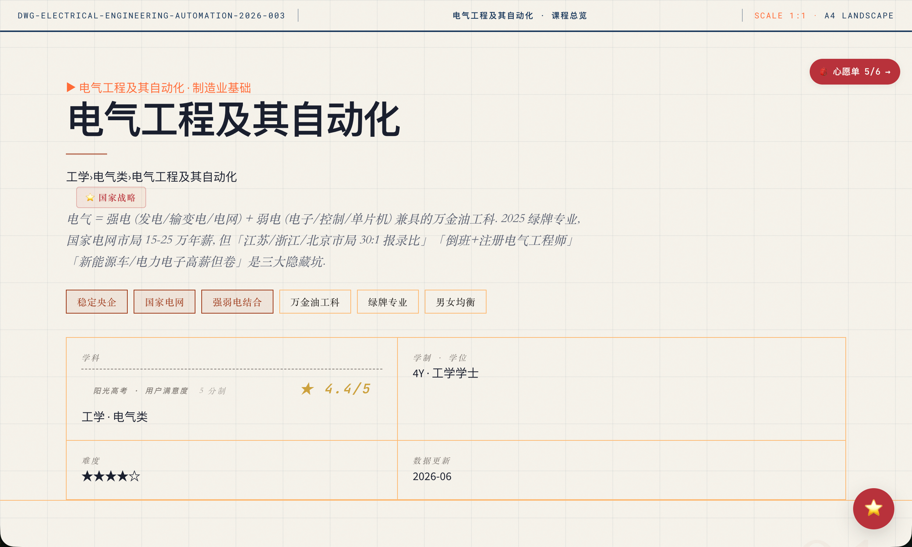
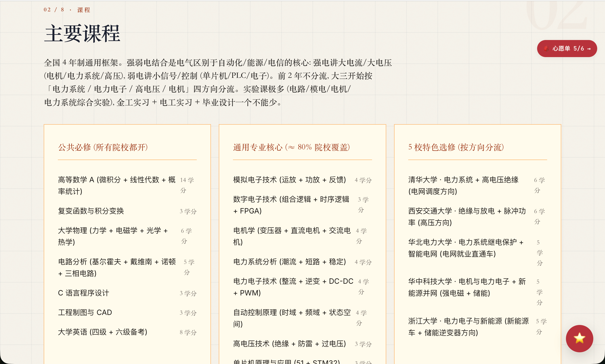
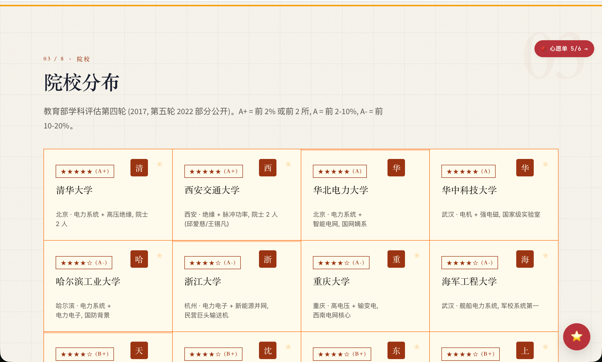
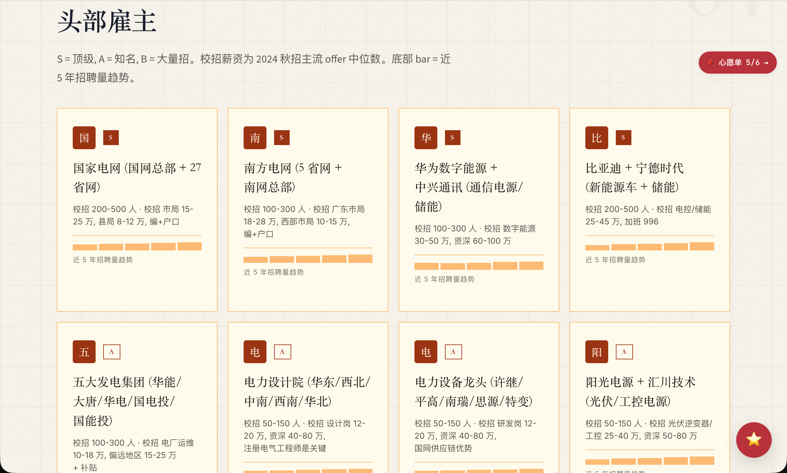
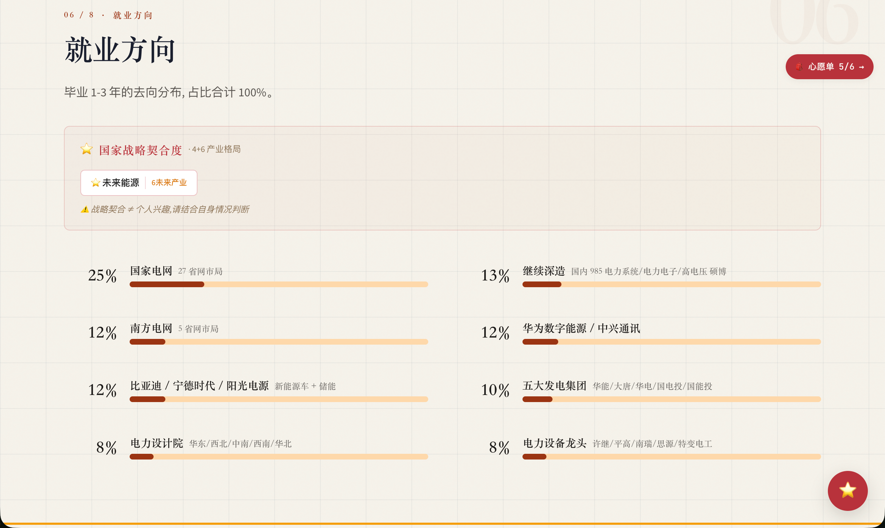
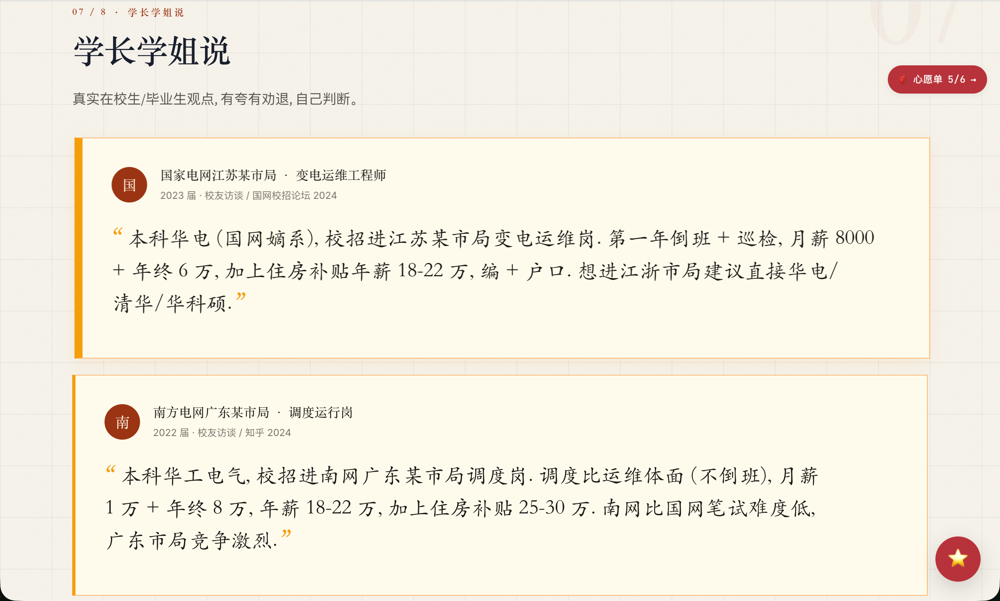

# gaokao-major-explorer 技术架构 · 一句 prompt 出本科专业精品介绍

> 30 天 loop engineering 沉淀,16 天搭完
> 2026-06-26 · Python 单进程 + 12 主题 · 1268 专业 · v3.0 → v4.0

> 配套 HTML 长图版:
> - 桌面优先: [`2026-06-26_skill-architecture.html`](2026-06-26_skill-architecture.html)
> - 公众号推送: [`2026-06-26_skill-architecture_wechat.html`](2026-06-26_skill-architecture_wechat.html)

---

这个故事是这样的。

6 月初的某个周末,我打开一个志愿填报的网站,搜了一下「心理学」。出来的页面是这样的:

一行小字标题,下面密密麻麻三四千字的表格,课程、院校、薪资、避坑全堆在一起,字号小到要眯着眼看。

我看了 30 秒就关掉了。

当时心里就想,这种体验真的太糟了。家长和考生打开浏览器想了解一个专业,结果看到的是一份像学术论文一样的 Word 文档。信息是全的,但**视觉是反人类的**。

---

## 01. 它能做什么:把每个专业做成一页设计长图文

我做的是把每个本科专业做成一页**带视觉设计的长图文**。

打开 gaokao-major-explorer 搜「电气工程及其自动化」,看到的是:



顶部一句话定位这专业是干嘛的,下面心率/难度/总评分三个数据卡片,再往下是 9 个章节,每个章节有自己的设计语言。

**主要课程**(公共必修 + 通用专业核心 + 3 校特色选修):



高数/线代/复变打底,模电/数电/电力系统搭骨架,清华/西交/华科三家各开不同的特色选修。

**院校分布**(教育部第四轮学科评估):



清华 A+ 排第一,西交 A+,华科 A。下面挨着哈工、浙大、重大。每所院校都标了校招主战场和进几年的招聘趋势。

**头部雇主**:



国家电网、南方电网、华为数字能源、比亚迪、五大发电集团。底部 bar 是近 5 年校招量趋势,国网扩、新势力收,趋势一目了然。

**就业方向**(占比 100%,主战场 + 5 个细分方向):



国家电网 25%,南方电网 12%,比亚迪/宁德时代 12%。这仨加起来快一半,剩下五大发电 / 电力设计院 / 华为/宁德/中航锂 / 比亚迪等。

**学长学姐说**(真实在校生/毕业生观点):



两条真实引文,一位国网江苏苏南局的 2023 届学长,一位南网广东东莞局的 2022 届学长,具体到工资、地点、上班强度,这种内容不是凭空能编的。

整页是**设计好的长图文**,不是密密麻麻的文字表格。每个专业一种视觉风格,计算机是黑客终端,医学是手术仪表,法学是羊皮卷宗 — 一共 12 套。

---

## 02. 它是怎么来的

这件事最初的动机很朴素。

我做这个 skill,是因为身边常有人问我「高考报志愿有什么建议」。我是工程师,不太懂怎么帮人填志愿,但**我会做工具**。既然志愿填报最缺的是「专业的深度介绍」,那能不能我先做一份?

说干就干。

最开始一周,**我一个人写数据**。

打开教育部第四轮学科评估的 PDF,把 92 个专业类的官方数据一个一个敲进 JSON。再打开知乎,搜每个专业的真实评价,把有共鸣的回答整理成「学长学姐说」。

一天能做 5-8 篇。

做了 30 篇就做不动了。

不是体力问题,是**质量问题**。

回头看,前面 10 篇几乎全是同一个模板:
> 心理学是研究人类心理现象及其影响下的精神功能和行为活动的科学,主要课程包括普通心理学、发展心理学...

我不知道这种文字家长看了会怎么想,但我自己看,都觉得假。这种「定义 + 课程罗列」的标准答案,跟维基百科有啥区别?读了跟没读一样。

而且更糟糕的是,我开始发现很多「课程表」其实是错的。我把「社会心理学」放进了「普通心理学」专业的公共必修里 — 看着没毛病,但仔细一想,那其实是社会学的东西,根本不是心理学必修。

**6/17 那周,我决定让 AI 帮我扩量**。

我跟 AI 说,「你照着这个模板,把这 50 个冷门专业也写出来」。AI 写得飞快,两天产出了 365 篇。

我 review 的时候,哭了。

不是感动,是**质量崩盘**。

平均分从 7.5 掉到 6.8,40% 篇被审核工具判了「拒收」。更可怕的是,我打开 AI 写的「草学」专业介绍,通篇都是「草学是研究草本植物的科学」「毕业生主要去农业局工作」,这种东西发出去,是要被考生家长骂死的。

那天晚上,我重新理解了一件事:

> **AI 能帮你写得更快,但不能帮你写得更真**。

---

## 03. 救命稻草:质量管线

6/18,smart_audit.py 上线。

这玩意儿干啥的?简单说,就是**先用 1 秒启发式检查每篇内容**(字段齐不齐、明显错误有没有),**只对怀疑有问题的篇调大模型深审**(每篇 2 分钟、¥0.5)。

效果立竿见影。

上线前平均分 7.0,上线后第一次批量审计 60 篇,**直接 9.05**。8 分以上的篇数从 337 涨到 480。

成本呢?整 600 篇审计,2-3 小时,¥40。之前朴素全审要 9.3 小时、¥140。

**砍掉 70% 成本,覆盖反而提升**。

这事给我的感受是,**质量这东西,跟「更多内容」不是反比关系**。

我以前觉得,要保证质量就得少做、要每篇都人工精修。但真正管用的不是「更努力」,是「更好的反馈闭环」。让对的篇快速过,让错的篇被抓住重写,而不是每篇都按最高标准卡。

具体流水线藏在 `docs/PIPELINE_major_quality.md` 里,9 步,我就不展开了。要说的一点是,**步骤 5 的智能路由,就是这套闭环的核心**。

```
Layer 1 (1 秒/篇, 免费)
  启发式脚本检查字段完整 + 反污染规则

Layer 2 (2 分钟/篇, ¥0.5)
  大模型深度审计, 只对触发以下任一条件的篇跑:
    ① 第一关报错
    ② 第一关警告
    ③ 没有历史审计记录
    ④ 上次分数 < 7
    ⑤ 最近改过
```

---

## 04. 16 天演化:质量从 7.0 拉到 9.05

整个项目只用了 16 天。

我把它放在时间线里:

| 日期 | 发生了什么 | 平均分 |
|---|---|---|
| 6/10 | 第一版渲染引擎跑通,做出第一篇 CS 长图文 | ~7.0 |
| 6/12 | 引擎重构:单文件拆成 12 文件包,主题从 4 套扩到 12 套 | ~7.0 |
| 6/17 | 扩量冲刺,篇数从 78 涨到 367 | ~7.0 |
| **6/18** | **质量管线上线**:智能路由审计 | **7.0 → 7.6** |
| 6/19 | 16 篇缺审计的篇目补审完工 | 7.31 |
| 6/20 | 30 篇合并,质量分持续爬坡 | 7.57 |
| 6/21 | 14 篇精修推到 ≥8 | ~8.0 |
| 6/22 | 60 篇用智能路由批量审计 | 9.05 |
| 6/23 | 多批缺口补全 + 抽查复核 | 8.87 |
| 6/24 | 22 篇医学 5 年制完美恢复 | 9.05 |

**6/18 是分水岭**。

之前篇数上去了质量没变,之后质量分 7 天从 7.6 爬到 9.05。**关键拐点不是我写得更好,是流水线把所有篇都拉到了 7+ 分**。

---

## 05. 关于「AI 写的」这件事

聊到这里,有个事我想诚实说。

**这 600 多篇专业介绍,绝大多数是 AI 写的。**

不是我在电脑前一行一行敲出来的。我做的是:**AI 出初稿 + 我审核关键字段 + 关键章节精修 + 智能路由审计**。

我也想过要不要装一下,说「每篇都是我熬夜手写的」。但想了下,**这种装,被识破的概率几乎 100%**,而且就算一时没人识破,我自己也会心虚。

这事我想得很开。

高考志愿这件事,信息量太大,纯靠人写,根本写不完 600 篇;但纯靠 AI,质量又会崩。**唯一可行的,就是 AI 写 + 人审的协作**。

我做的事,主要是这四件:

**挑哪些篇要写**。这事儿 AI 做不了,它不知道哪些专业热门、哪些小众但重要(比如监狱学、邮政工程,家长其实很关心)。

**审关键字段**。课程表里有没有把「社会心理学」放进「普通心理学」必修这种硬伤;薪资 P75 有没有高到离谱(比如 200 万)—— 这些一眼能看出来。

**改关键段落**。AI 写的「该校就业率 95%」这种空话,我会改成具体的「去年毕业 200 人,签约电网 80 人、新能源车企 50 人」。

**听被骂**。有家长在评论区说「你写的临床医学,把规培时间都写错了,害死人」,我立刻回去改。AI 不会主动听骂。

这套协作不是「我用 AI 偷懒」,是「AI 帮我把繁琐的事干了,我专心做判断」。

---

## 06. 几个我踩过的坑

写到最后,聊几个真实的教训。

**第一,模板套话是 AI 写作的第一原罪**。

> 「心理学是研究人类心理现象及其影响下的精神功能和行为活动的科学」

这种话,跟没写一样。AI 特别爱写,一不留神就糊你一脸。我的对策是,开头第一句,必须有一个**具体的事实**或**反差**。否则直接打回。

**第二,跨专业串台是 AI 的高频毛病**。

我让 AI 写「社会学」专业,它经常写「需要编程能力」「毕业生去互联网公司」 — 这是把 CS 专业的皮套到社会学上,看着没毛病,细想全是坑。

**第三,占位数据是 AI 的另一个坑**。

早期有篇「材料化学」,AI 写了「15% 毕业生去金融机构」 — 这种数据一看就是凑数的,真实专业没人去金融。我的对策是,**任何没数据源的比例,直接删掉,不要让 AI 编**。

**第四,课程表里的「公共必修 vs 专业核心」很容易搞错**。

公共必修是高数/英语/思政/制图,这些是**所有院校都开**的;专业核心是模电/数电/电力系统,这些是**这个专业才开**的。AI 经常把它们混在一起放。

**第五,自动化截图工具在今天早上把我坑了**。

我本来想用 Playwright 截一张临床医学页面的图嵌进文章,结果 fonts.loli.net 的字体加载永远卡死,IntersectionObserver 触发的 lazy section 也渲染不出来。手动截图 + 嵌入,反而更可控。

这五条,每一条都让我重新理解了一遍「AI 能干什么、不能干什么」。

---

· · · · ·

写完回头看,这个 skill 真正的护城河不是 12 套主题,是围绕它们建的质量反馈闭环。

引擎是骨架,流水线是肌肉,我自己审核的那部分,是神经。

---

*gaokao-major-explorer · v3.0 → v4.0 · 2026-06-26*
*16 天搭完, 600+ 精品专业, 平均分 9.05*
